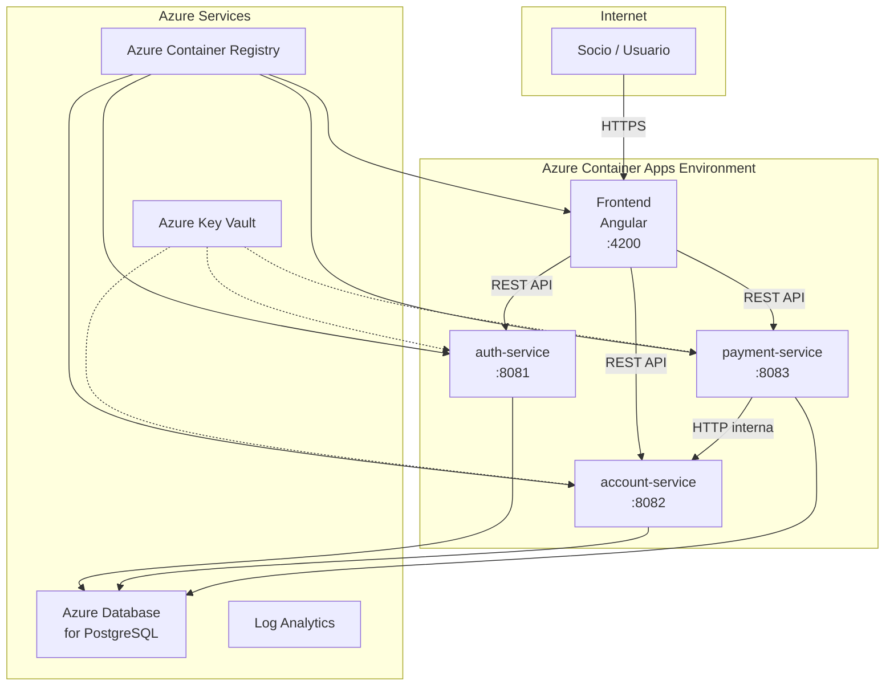
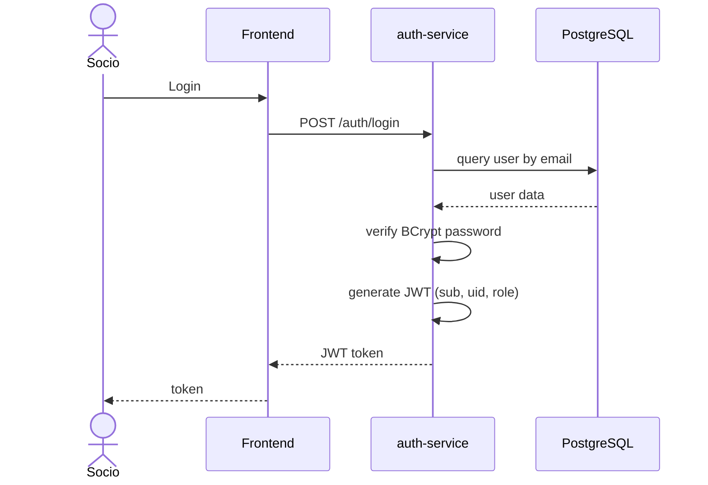
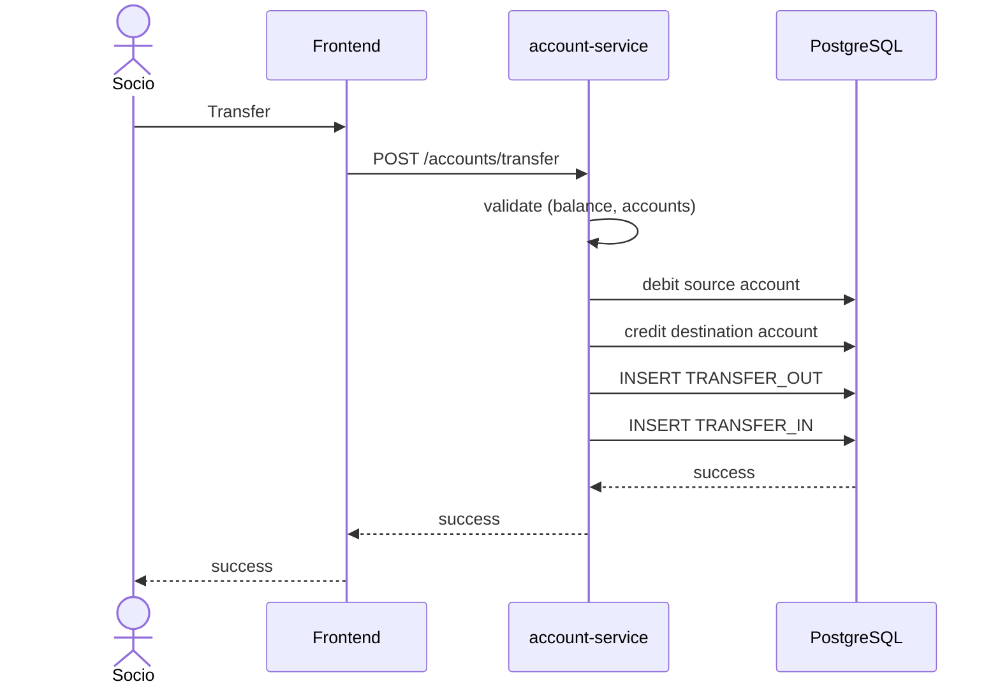
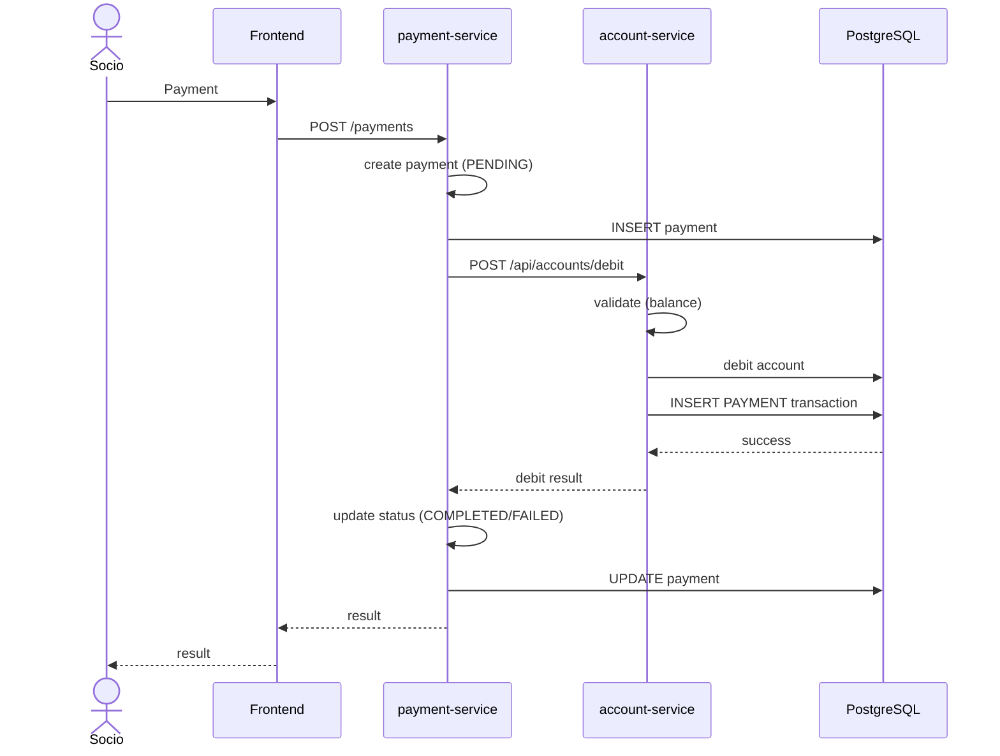

# Coop EC

Aplicación financiera cooperativa construida con Angular, microservicios Spring Boot y servicios cloud-native de Microsoft Azure.

---

## Índice

1. [Overview](#1-overview)
2. [Features](#2-features)
3. [Technology Stack](#3-technology-stack)
4. [Repository Structure](#4-repository-structure)
5. [Architecture](#5-architecture)
6. [Deployment Architecture](#6-deployment-architecture)
7. [Sequence Diagrams](#7-sequence-diagrams)
8. [Microservices](#8-microservices)
9. [API Documentation](#9-api-documentation)
10. [Security](#10-security)
11. [Local Development](#11-local-development)
12. [Configuration](#12-configuration)
13. [Docker](#13-docker)
14. [Testing](#14-testing)
15. [Infrastructure as Code](#15-infrastructure-as-code)
16. [Azure Deployment](#16-azure-deployment)
17. [Project Status](#17-project-status)
18. [Dataset](#18-dataset)
19. [Hallazgos](#19-hallazgos)

---

## 1. Overview

Coop EC es una plataforma de banca digital diseñada para instituciones financieras cooperativas. Permite gestión de socios, operaciones de cuentas, transferencias y procesamiento de pagos mediante una arquitectura de microservicios moderna desplegada en Azure Container Apps.

**Arquitectura:** 4 aplicaciones desplegables, 1 frontend y 3 microservicios, comunicándose vía REST APIs, con PostgreSQL como persistencia, desplegadas en Azure con Infrastructure as Code.

**Capacidades principales:**
- Autenticación y autorización de socios
- Gestión de cuentas con saldo en tiempo real
- Transferencias peer-to-peer
- Procesamiento de pagos con integración al account-service
- Historial de operaciones con paginación server-side

---

## 2. Features

- **Autenticación:** Registro, login, gestión de sesiones con JWT
- **Cuentas:** Creación automática al primer acceso, consulta de saldo, historial de transacciones
- **Transferencias:** Transferencias atómicas peer-to-peer con validación de saldo
- **Pagos:** Procesamiento de pagos con solicitud de débito al account-service
- **Historial:** Transacciones y pagos paginados server-side
- **Frontend:** Angular 21 con Material Design 3, SSR y proxy hacia backends

---

## 3. Technology Stack

### Frontend
- Angular 21
- TypeScript
- Angular Material / Material Design 3
- Server-Side Rendering (SSR)

### Backend
- Java 21
- Spring Boot 4.1.0
- Spring Security
- Spring Data JPA
- PostgreSQL
- Flyway
- OpenAPI / Swagger

### Cloud
- Azure Container Apps
- Azure Container Registry
- Azure Database for PostgreSQL
- Azure Key Vault
- Managed Identity
- Azure Monitor / Log Analytics

### Infrastructure as Code
- Azure Bicep modular

### Testing
- Unit Tests: JUnit 5 + Mockito
- Integration Tests: Testcontainers + PostgreSQL
- Contract Tests: API contract validation
- End-to-End Tests: Full stack flow

---

## 4. Repository Structure

```
coop-ec/
├── frontend/                    # Angular 21 SSR application
├── services/
│   ├── auth-service/           # Authentication & authorization
│   ├── account-service/        # Accounts, transfers, transactions
│   └── payment-service/        # Payment processing
├── infrastructure/
│   ├── main.bicep             # Main orchestrator
│   ├── modules/               # Bicep modules
│   └── parameters/            # Environment parameters
├── scripts/
│   └── data/                  # Berka dataset importer
├── docs/
│   └── architecture/          # C4 diagrams
├── docker-compose.yml
└── README.md
```

**Directorios:**
- `frontend/` — Aplicación Angular SSR con Material Design 3
- `services/` — Microservicios Spring Boot (auth, account, payment)
- `infrastructure/` — Infraestructura modular Azure Bicep
- `scripts/data/` — Importador de dataset Berka/PKDD'99
- `docs/architecture/` — Diagramas C4 y arquitectura de despliegue

---

## 5. Architecture

La documentación arquitectónica utiliza C4 Model niveles 1-3 con diagramas de despliegue y secuencia.

Ver [docs/architecture/](docs/architecture/) para diagramas:

- C4 Level 1 — System Context
- C4 Level 2 — Container Diagram
- C4 Level 3 — Component Diagrams (auth, account, payment)
- Azure Deployment Diagram
- Sequence Diagrams (authentication, transfer, payment)

---

## 6. Deployment Architecture



**Recursos:**
- **Público:** Frontend (vía Container Apps ingress)
- **Internos:** auth-service, account-service, payment-service
- **Datos:** Azure Database for PostgreSQL
- **Secretos:** Azure Key Vault
- **Imágenes:** Azure Container Registry
- **Monitoreo:** Log Analytics / Azure Monitor

---

## 7. Sequence Diagrams

### 7.1 Autenticación



### 7.2 Transferencia



### 7.3 Procesamiento de Pago



---

## 8. Microservices

| Servicio | Responsabilidad | Tecnología | Puerto |
|----------|----------------|------------|--------|
| auth-service | Autenticación, autorización, gestión de usuarios | Spring Boot, JWT, BCrypt | 8081 |
| account-service | Cuentas, transferencias, historial de transacciones | Spring Boot, JPA, Flyway | 8082 |
| payment-service | Procesamiento de pagos, solicitudes de débito | Spring Boot, RestClient | 8083 |
| frontend | Web UI, SSR, routing | Angular 21, Material 3 | 4200 |

---

## 9. API Documentation

Todos los servicios backend exponen documentación OpenAPI:

- **auth-service:** http://localhost:8081/swagger-ui.html
- **account-service:** http://localhost:8082/swagger-ui.html
- **payment-service:** http://localhost:8083/swagger-ui.html

OpenAPI JSON disponible en `/v3/api-docs` de cada servicio.

---

## 10. Security

- **Spring Security** con autenticación JWT
- **BCrypt** para hashing de contraseñas
- **Role-based access** (USER, ADMIN)
- **JWT propagation** entre servicios (payment → account)
- **Azure Key Vault** para secretos de producción
- **Managed Identity** para autenticación de servicios Azure
- **Variables de entorno** para configuración
- **HTTPS** en producción vía Azure Container Apps

---

## 11. Local Development

### Prerrequisitos

- Java 21
- Maven 3.9+
- Node.js 22+
- Docker & Docker Compose
- PostgreSQL (o usar Docker Compose)

### Inicio Rápido

```bash
# Iniciar todos los servicios
docker compose up

# Acceder al frontend
open http://localhost:4200
```

### Inicio Manual

```bash
# Iniciar PostgreSQL
docker compose up postgres -d

# Iniciar servicios (cada uno en terminal separado)
cd services/auth-service && mvn spring-boot:run
cd services/account-service && mvn spring-boot:run
cd services/payment-service && mvn spring-boot:run

# Iniciar frontend
cd frontend && npm start
```

---

## 12. Configuration

### Variables de Entorno

| Variable | Descripción | Default |
|----------|-------------|---------|
| `DB_HOST` | PostgreSQL host | localhost |
| `DB_PORT` | PostgreSQL port | 5432 |
| `DB_NAME` | Database name | coop |
| `DB_USER` | Database user | coop |
| `DB_PASSWORD` | Database password | coop |
| `JWT_SECRET` | JWT signing secret | dev-secret-change-me |
| `ACCOUNT_SERVICE_URL` | Account service URL | http://localhost:8082 |
| `AUTH_SERVICE_URL` | Auth service URL | http://localhost:8081 |
| `PAYMENT_SERVICE_URL` | Payment service URL | http://localhost:8083 |

---

## 13. Docker

Cada aplicación tiene su propio Dockerfile con build multi-stage:

- **Frontend:** Node.js build + Nginx/Node SSR
- **Backend services:** Maven build + JRE 21

Docker Compose orquesta el entorno local completo:

```bash
docker compose up          # Iniciar todos los servicios
docker compose up -d       # Iniciar en background
docker compose down        # Detener todos los servicios
```

Azure Container Registry almacena las imágenes de producción.

---

## 14. Testing

### Unit Tests

```bash
cd services/auth-service && mvn test
cd services/account-service && mvn test
cd services/payment-service && mvn test
```

### Integration Tests

Requiere Testcontainers, Docker debe estar ejecutándose:

```bash
mvn verify -Pintegration-tests
```

### Contract Tests

```bash
mvn verify -Pcontract-tests
```

### End-to-End Tests

```bash
# Requiere stack completo ejecutándose
mvn verify -Pe2e-tests
```

### Volume Tests

```bash
# Importar dataset Berka
./scripts/data/import-berka.sh full

# Ejecutar validación de volumen
./scripts/data/volume-test.sh
```

---

## 15. Infrastructure as Code

Azure Bicep administra la infraestructura con diseño modular:

```
infrastructure/
├── main.bicep                    # Main orchestrator
├── modules/
│   ├── acr.bicep                # Container Registry
│   ├── container-app-environment.bicep
│   ├── frontend-container-app.bicep
│   ├── auth-container-app.bicep
│   ├── account-container-app.bicep
│   ├── payment-container-app.bicep
│   ├── postgres.bicep           # PostgreSQL
│   ├── key-vault.bicep          # Key Vault
│   ├── identities.bicep         # Managed Identity
│   └── monitoring.bicep         # Log Analytics
└── parameters/
    └── dev.bicepparam           # Development environment
```

**Principios:**
- `main.bicep` solo compone módulos
- Cada módulo tiene responsabilidad única
- Secretos nunca en parámetros versionados
- Entorno específico vía archivos `.bicepparam`

---

## 16. Azure Deployment

```bash
# Desplegar infraestructura y aplicaciones
./scripts/deploy.sh
```

**Proceso:**
1. Bicep valida y despliega recursos Azure
2. Docker images construidas y subidas a ACR
3. Container Apps actualizadas con nuevas imágenes
4. Servicios reinician sin downtime

**Recursos creados:**
- `rg-coop-dev` — Resource Group
- `acrcoopdev` — Container Registry
- `cae-coop-dev` — Container Apps Environment
- `ca-coop-{service}-dev` — Container Apps
- `psql-coop-dev` — PostgreSQL
- `kv-coop-dev` — Key Vault

---

## 17. Project Status

**Etapa:** MVP Development

**Completado:**
- 001-010: Funcionalidad core (auth, accounts, payments, frontend)
- 011: Testing (unit, integration, contract, E2E)
- 012: Infraestructura Bicep
- 013: Script de deployment Azure
- 014: Observability (actuator, correlation IDs)
- 015: Importador dataset Berka
- 016: Pruebas de volumen
- 017: Documentación (este documento)

**Pendiente:**
- 018: Alcance fuera del MVP
- 019: Criterio de finalización

---

## 18. Dataset

Este proyecto utiliza el dataset financiero Berka/PKDD'99 para testing y demostración.

**Fuente:** PKDD'99 Discovery Challenge (https://sorry.vse.cz/~berka/challenge/pkdd1999/)

**Uso:** Importar vía `./scripts/data/import-berka.sh` — no se carga automáticamente.

Ver [scripts/data/README.md](scripts/data/README.md) para detalles.

---

## 19. Hallazgos

### Spring Boot 4.1.0 - Cambios de compatibilidad

Durante la ejecucion local se encontraron errores de compilacion por cambios de paquetes en Spring Boot 4.1.0:

- `TestRestTemplate` se movio de `org.springframework.boot.test.web.client` a `org.springframework.boot.resttestclient`
- `HealthIndicator` y `Health` se movieron de `org.springframework.boot.actuate.health` a `org.springframework.boot.health.contributor`
- Los records de Java 21 no permiten metodos estaticos con el mismo nombre que un componente del record

Estos cambios fueron corregidos en account-service y payment-service.

### Estrategia de ejecucion recomendada

El orden correcto para validar el sistema es:

1. **Local individual** — Ejecutar cada servicio por separado con `mvn spring-boot:run` para detectar errores de compilacion o configuracion antes de introducir complejidad de contenedores
2. **Docker Compose** — Levantar el stack completo para validar la comunicacion entre servicios, health checks y dependencias
3. **Nube** — Desplegar en Azure Container Apps una vez que el stack local funcione correctamente

### Spring Native - Estado de la infraestructura

Los modulos Bicep de Container Apps estan preparados para imagenes nativas. No contienen variables JVM especificas. El ajuste necesario es reducir la memoria asignada de `0.5Gi` a `0.128Gi` por servicio, ya que las imagenes nativas usan aproximadamente 50MB en vez de 300MB. Los Dockerfiles deben modificarse para usar `ghcr.io/graalvm/native-image` en el build y una imagen minima en runtime.
