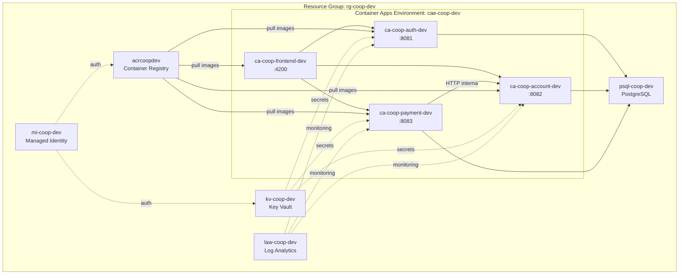

# Azure Deployment Diagram

**Recursos:**
| Recurso | Nombre | Tipo | Acceso |
|---------|--------|------|--------|
| Resource Group | rg-coop-dev | Container | Interno |
| Container Registry | acrcoopdev | ACR | Interno (Managed Identity) |
| Container Apps Environment | cae-coop-dev | Environment | Interno |
| auth-service | ca-coop-auth-dev | Container App | Interno |
| account-service | ca-coop-account-dev | Container App | Interno |
| payment-service | ca-coop-payment-dev | Container App | Interno |
| frontend | ca-coop-frontend-dev | Container App | Público (ingress) |
| PostgreSQL | psql-coop-dev | Database | Interno |
| Key Vault | kv-coop-dev | Vault | Interno (Managed Identity) |
| Managed Identity | mi-coop-dev | Identity | System-assigned |
| Log Analytics | law-coop-dev | Monitoring | Interno |

**Flujo de imágenes:**
1. Docker build → ACR (acrcoopdev)
2. Container Apps hacen pull de ACR
3. Managed Identity autentica ACR pull

**Flujo de secretos:**
1. Key Vault almacena secretos de producción
2. Managed Identity concede acceso
3. Container Apps referencian secretos de Key Vault
