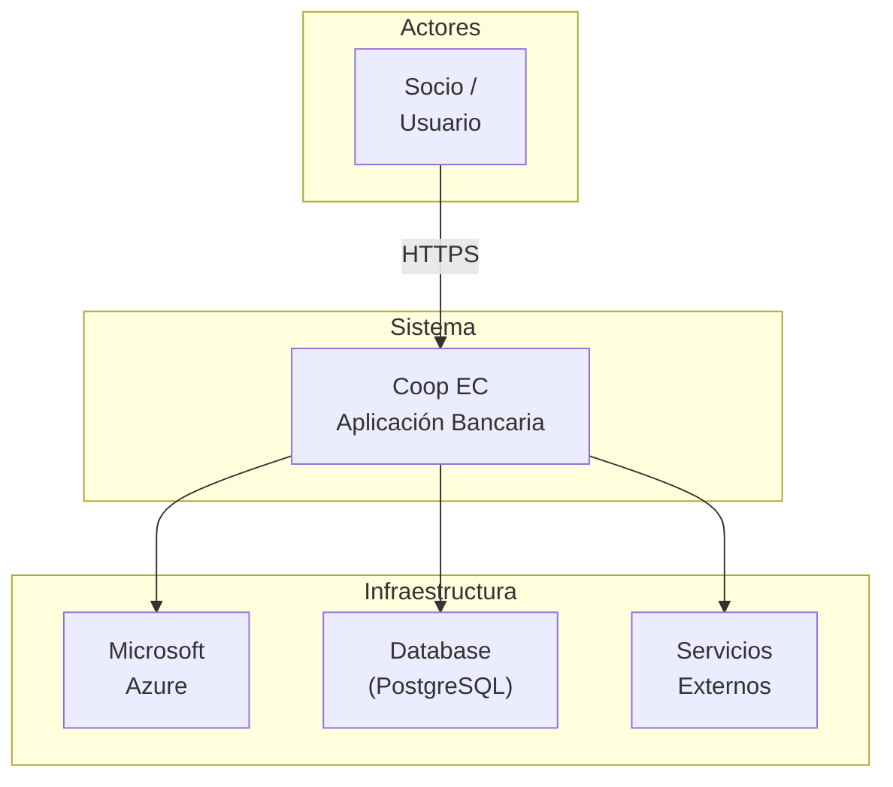

# C4 Level 1 — System Context

**Actores:**
- **Socio/Usuario:** Usuario final accediendo a la aplicación bancaria
- **Coop EC:** El sistema bancario cooperativo
- **Microsoft Azure:** Infraestructura cloud (Container Apps, ACR, Key Vault)
- **Database:** PostgreSQL para almacenamiento persistente
- **External Services:** Integraciones con terceros (futuro)

**Interacciones principales:**
- El usuario accede a Coop EC vía HTTPS
- Coop EC se ejecuta en Azure Container Apps
- Coop EC almacena datos en PostgreSQL
- Azure provee infraestructura, secretos y monitoreo
