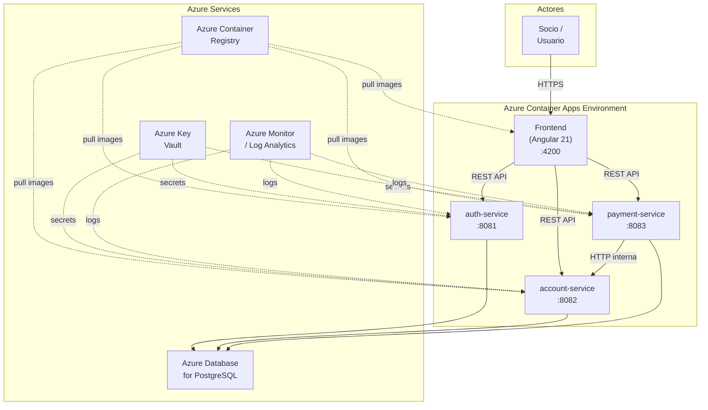

# C4 Level 2 — Container Diagram

**Containers:**
| Container | Tecnología | Puerto | Responsabilidad |
|-----------|------------|--------|----------------|
| Frontend | Angular 21, SSR | 4200 | Web UI, routing, proxy |
| auth-service | Spring Boot | 8081 | Autenticación, JWT, usuarios |
| account-service | Spring Boot | 8082 | Cuentas, transferencias, historial |
| payment-service | Spring Boot | 8083 | Pagos, solicitudes de débito |
| PostgreSQL | Azure Database | 5432 | Almacenamiento persistente |

**Comunicación:**
- Frontend → Microservicios: REST API (HTTPS en producción)
- Microservicios → PostgreSQL: JDBC
- payment-service → account-service: HTTP (solicitud de débito)
- Todos los servicios → Key Vault: Secretos (vía Managed Identity)
