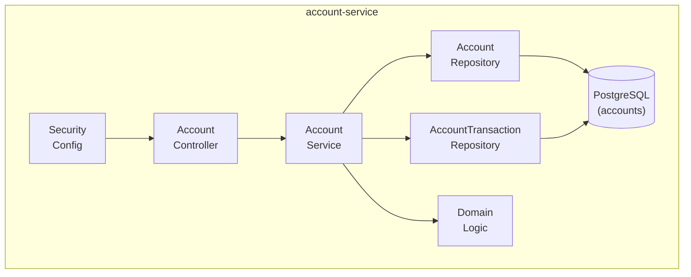

# C4 Level 3 — account-service Components

**Componentes:**
| Componente | Responsabilidad |
|------------|-----------------|
| SecurityConfig | Spring Security, validación JWT, extracción de CurrentUser |
| AccountController | REST endpoints: /me, /me/transactions, /transfer, /debit |
| AccountService | Lógica de negocio: crear cuenta, transferir, débito, historial |
| AccountRepository | Acceso a datos: CRUD de cuentas |
| AccountTransactionRepository | Acceso a datos: queries de transacciones con paginación |
| Domain Logic | Validación de saldo, transferencias atómicas, tipos de transacción |

**Flujo de datos:**
1. Request → SecurityConfig (JWT filter, CurrentUser)
2. AccountController recibe request
3. AccountService procesa lógica de negocio
4. Domain Logic valida reglas (saldo, atomicidad)
5. Repositories persisten en PostgreSQL
