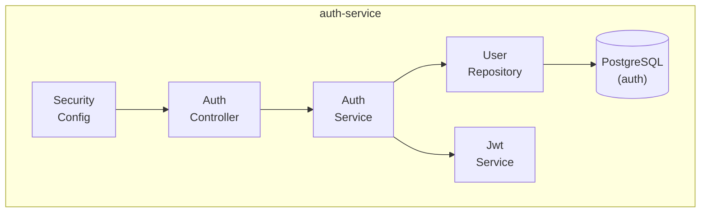

# C4 Level 3 — auth-service Components

**Componentes:**
| Componente | Responsabilidad |
|------------|-----------------|
| SecurityConfig | Configuración Spring Security, JWT filter chain |
| AuthController | REST endpoints: /register, /login, /me |
| AuthService | Lógica de negocio: registro, login, generación de tokens |
| UserRepository | Acceso a datos: CRUD de usuarios |
| JwtService | Creación, validación y parsing de tokens JWT |

**Flujo de datos:**
1. Request → SecurityConfig (JWT filter)
2. AuthController recibe request
3. AuthService procesa lógica de negocio
4. UserRepository persiste en PostgreSQL
5. JwtService genera/valida tokens
