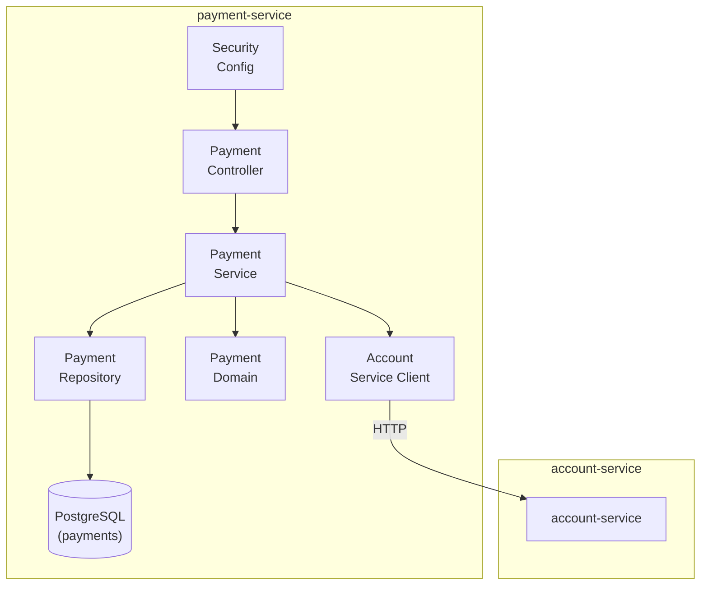

# C4 Level 3 — payment-service Components

**Componentes:**
| Componente | Responsabilidad |
|------------|-----------------|
| SecurityConfig | Spring Security, validación JWT, extracción de CurrentUser |
| PaymentController | REST endpoints: POST /payments, GET /payments/{id}, GET /payments |
| PaymentService | Lógica de negocio: crear pago, solicitar débito, actualizar estado |
| PaymentRepository | Acceso a datos: CRUD de pagos |
| Payment Domain | Gestión de estados (PENDING → COMPLETED/FAILED) |
| AccountServiceClient | Cliente HTTP hacia account-service para solicitudes de débito |

**Flujo de datos:**
1. Request → SecurityConfig (JWT filter, CurrentUser)
2. PaymentController recibe request
3. PaymentService crea pago (PENDING)
4. AccountServiceClient envía solicitud de débito a account-service
5. PaymentService actualiza estado (COMPLETED/FAILED)
6. PaymentRepository persiste en PostgreSQL
