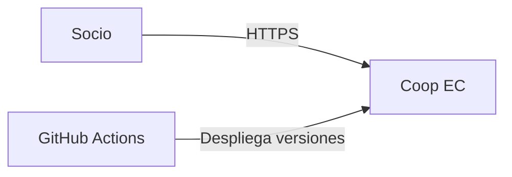

# C4 Level 1 — System Context

Coop EC permite autenticarse, administrar cuentas, transferir saldo, registrar pagos simulados y consultar el historial. Se ejecuta en Azure y su infraestructura se administra con Terraform.
