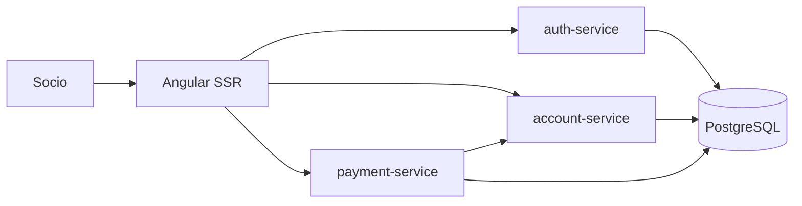

# C4 Level 2 — Container Diagram

- Angular SSR expone la aplicación y enruta `/api/*`.
- Los tres microservicios Spring Boot validan JWT y persisten en PostgreSQL.
- `payment-service` solicita débitos a `account-service` mediante REST.
