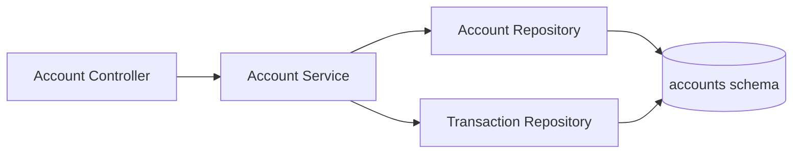

# C4 Level 3 — account-service Component Diagram

```mermaid
flowchart LR
    Controller[Account Controller] --> Service[Account Service]
    Service --> Accounts[Account Repository]
    Service --> Transactions[Transaction Repository]
    Accounts --> DB[(accounts schema)]
    Transactions --> DB
```

El servicio concentra las reglas de saldo y ejecuta transferencias y débitos de forma transaccional.
