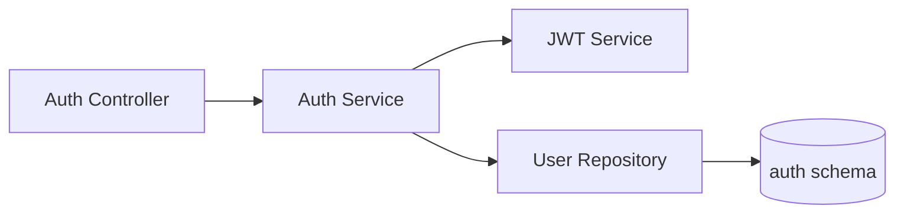

# C4 Level 3 — auth-service Component Diagram

```mermaid
flowchart LR
    Controller[Auth Controller] --> Service[Auth Service]
    Service --> JWT[JWT Service]
    Service --> Repository[User Repository]
    Repository --> DB[(auth schema)]
```

El servicio registra usuarios, valida credenciales BCrypt y emite JWT.
