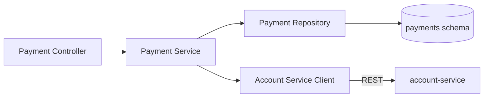

# C4 Level 3 — payment-service Component Diagram

```mermaid
flowchart LR
    Controller[Payment Controller] --> Service[Payment Service]
    Service --> Repository[Payment Repository]
    Service --> Client[Account Service Client]
    Repository --> DB[(payments schema)]
    Client -->|REST| Account[account-service]
```

El servicio registra el pago y delega el débito de la cuenta en `account-service`.
