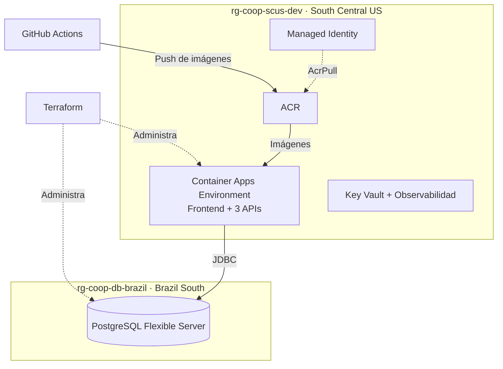

# Despliegue — Azure y Terraform

Terraform adopta los recursos existentes mediante `imports.tf` y los protege con `prevent_destroy`. GitHub Actions actualiza las imágenes; Terraform administra la forma de la infraestructura sin revertir esas etiquetas.
