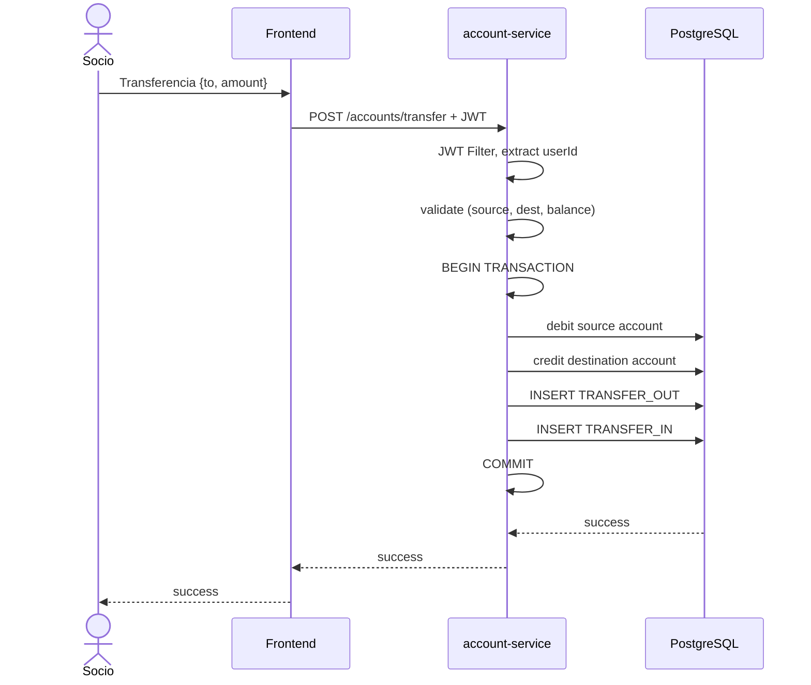

# Sequence Diagram — Account Transfer

## Reglas de Validación

1. La cuenta origen debe existir y pertenecer al usuario
2. La cuenta destino debe existir
3. Las cuentas origen y destino deben ser diferentes
4. El saldo de la cuenta origen debe ser >= monto de transferencia
5. La transferencia es atómica (todo o nada)

## Tipos de Transacción Creados

- **TRANSFER_OUT:** Débito de la cuenta origen
- **TRANSFER_IN:** Crédito a la cuenta destino

## Escenarios de Error

| Error | HTTP Status | Mensaje |
|-------|-------------|---------|
| Saldo insuficiente | 422 | Saldo insuficiente |
| Misma cuenta | 400 | No se puede transferir a la misma cuenta |
| Cuenta origen no encontrada | 404 | Cuenta origen no encontrada |
| Cuenta destino no encontrada | 404 | Cuenta destino no encontrada |
