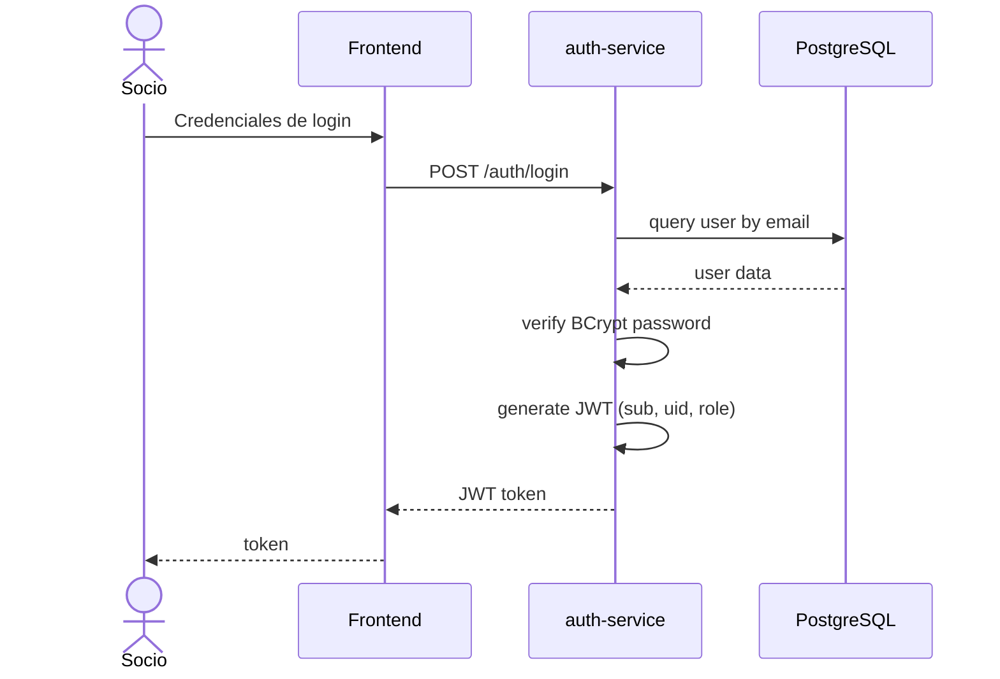
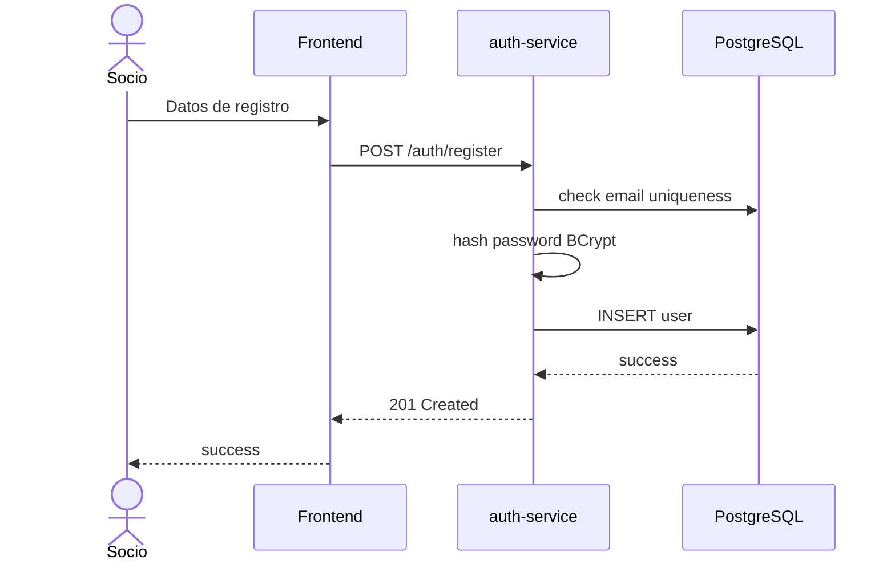
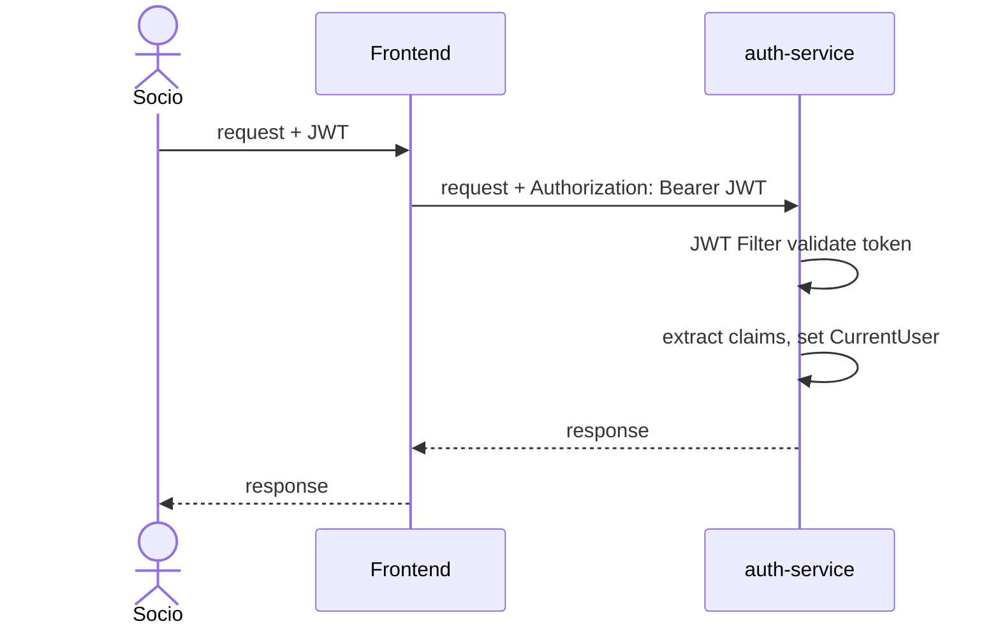

# Sequence Diagram — Authentication

## 7.1 Login Flow

```mermaid
sequenceDiagram
    actor User as Socio
    participant Angular as Frontend
    participant Auth as auth-service
    participant DB as PostgreSQL
    
    User->>Angular: Credenciales de login
    Angular->>Auth: POST /auth/login
    Auth->>DB: query user by email
    DB-->>Auth: user data
    Auth->>Auth: verify BCrypt password
    Auth->>Auth: generate JWT (sub, uid, role)
    Auth-->>Angular: JWT token
    Angular-->>User: token
```

## 7.2 Register Flow

```mermaid
sequenceDiagram
    actor User as Socio
    participant Angular as Frontend
    participant Auth as auth-service
    participant DB as PostgreSQL
    
    User->>Angular: Datos de registro
    Angular->>Auth: POST /auth/register
    Auth->>DB: check email uniqueness
    Auth->>Auth: hash password BCrypt
    Auth->>DB: INSERT user
    DB-->>Auth: success
    Auth-->>Angular: 201 Created
    Angular-->>User: success
```

## 7.3 JWT Validation

```mermaid
sequenceDiagram
    actor User as Socio
    participant Angular as Frontend
    participant Auth as auth-service
    
    User->>Angular: request + JWT
    Angular->>Auth: request + Authorization: Bearer JWT
    Auth->>Auth: JWT Filter validate token
    Auth->>Auth: extract claims, set CurrentUser
    Auth-->>Angular: response
    Angular-->>User: response
```
