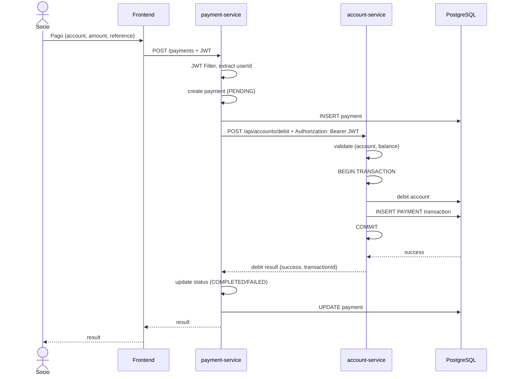
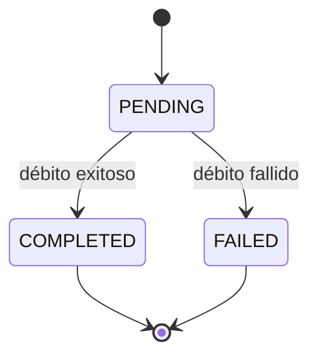

# Sequence Diagram — Payment Processing



## Estados de Pago



## Detalles de Comunicación

| Paso | De → A | Protocolo | Propósito |
|------|--------|-----------|-----------|
| 2 | Frontend → payment-service | REST/HTTPS | Crear pago |
| 5 | payment-service → PostgreSQL | JDBC | Persistir pago |
| 6 | payment-service → account-service | REST/HTTP | Solicitud de débito |
| 10-11 | account-service → PostgreSQL | JDBC | Persistir transacción |
| 14 | payment-service → PostgreSQL | JDBC | Actualizar estado del pago |

## Contrato de Solicitud de Débito

**Request:**
```json
POST /api/accounts/debit
{
  "accountNumber": "string",
  "amount": "number",
  "reference": "string"
}
```

**Response:**
```json
{
  "success": "boolean",
  "message": "string",
  "transactionId": "number"
}
```

## Escenarios de Error

| Error | Payment Status | Account Status |
|-------|----------------|----------------|
| Cuenta no encontrada | FAILED | N/A |
| Saldo insuficiente | FAILED | N/A |
| Servicio no disponible | FAILED | N/A |
| Éxito | COMPLETED | DEBITED |
