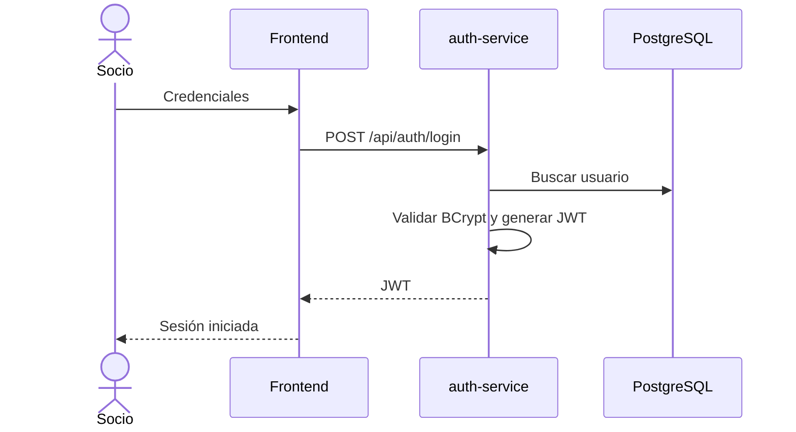

# Secuencia — Autenticación

```mermaid
sequenceDiagram
    actor User as Socio
    participant Web as Frontend
    participant Auth as auth-service
    participant DB as PostgreSQL

    User->>Web: Credenciales
    Web->>Auth: POST /api/auth/login
    Auth->>DB: Buscar usuario
    Auth->>Auth: Validar BCrypt y generar JWT
    Auth-->>Web: JWT
    Web-->>User: Sesión iniciada
```
