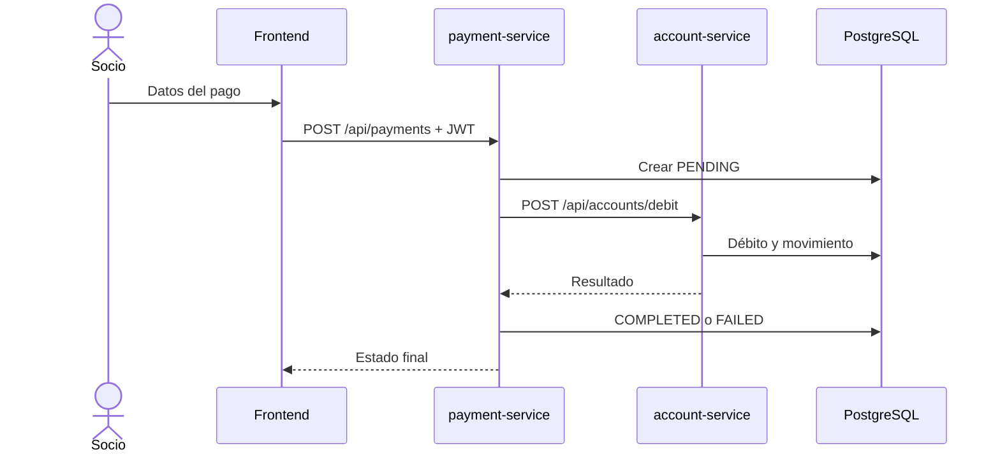

# Secuencia — Pago

```mermaid
sequenceDiagram
    actor User as Socio
    participant Web as Frontend
    participant Payment as payment-service
    participant Account as account-service
    participant DB as PostgreSQL

    User->>Web: Datos del pago
    Web->>Payment: POST /api/payments + JWT
    Payment->>DB: Crear PENDING
    Payment->>Account: POST /api/accounts/debit
    Account->>DB: Débito y movimiento
    Account-->>Payment: Resultado
    Payment->>DB: COMPLETED o FAILED
    Payment-->>Web: Estado final
```
