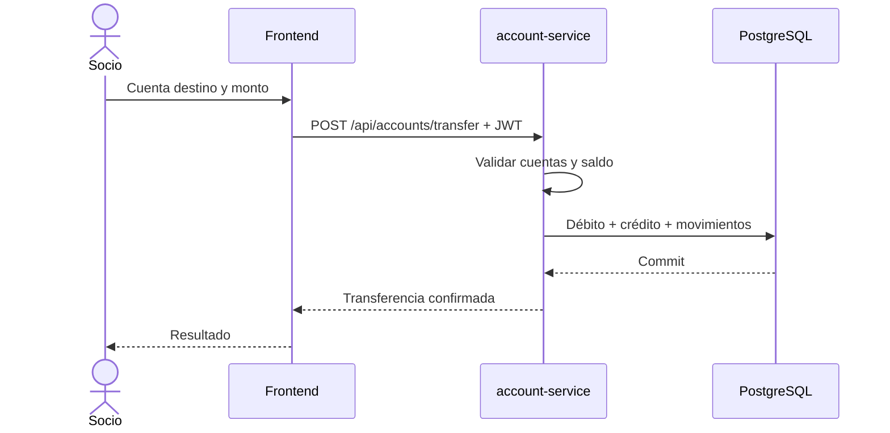

# Secuencia — Transferencia

```mermaid
sequenceDiagram
    actor User as Socio
    participant Web as Frontend
    participant Account as account-service
    participant DB as PostgreSQL

    User->>Web: Cuenta destino y monto
    Web->>Account: POST /api/accounts/transfer + JWT
    Account->>Account: Validar cuentas y saldo
    Account->>DB: Débito + crédito + movimientos
    DB-->>Account: Commit
    Account-->>Web: Transferencia confirmada
    Web-->>User: Resultado
```
